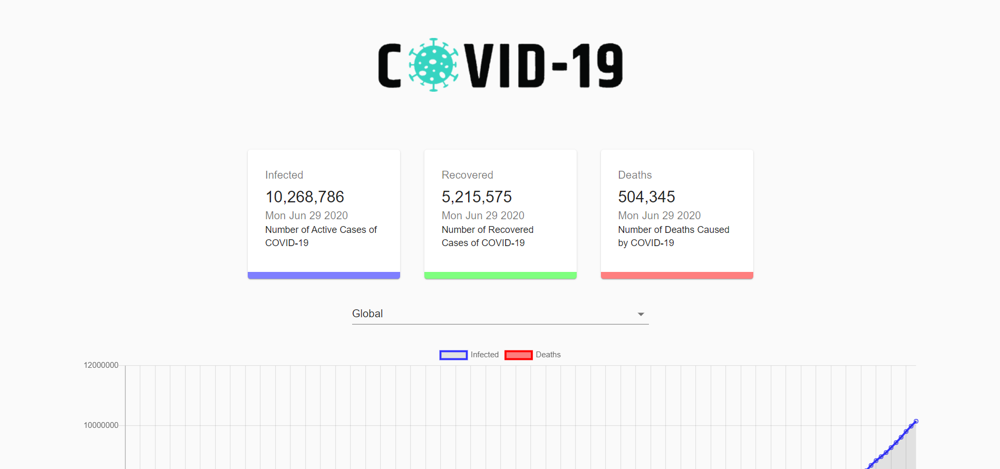
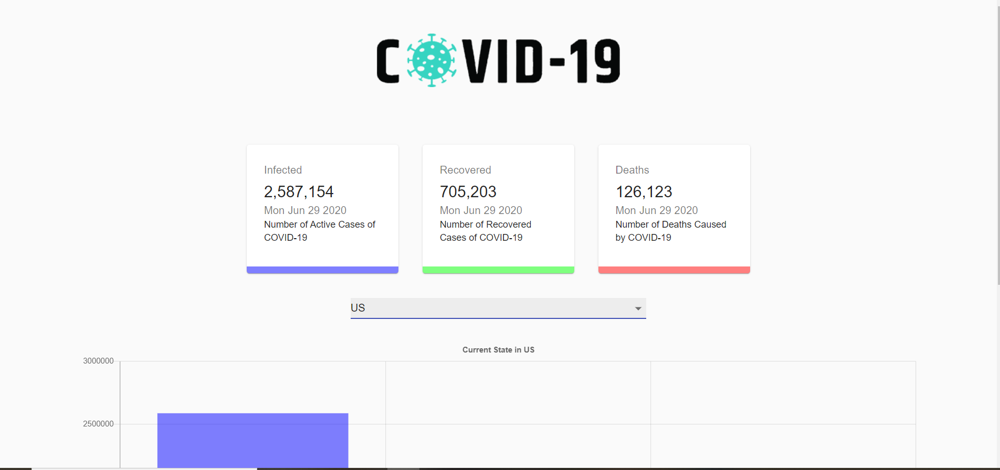
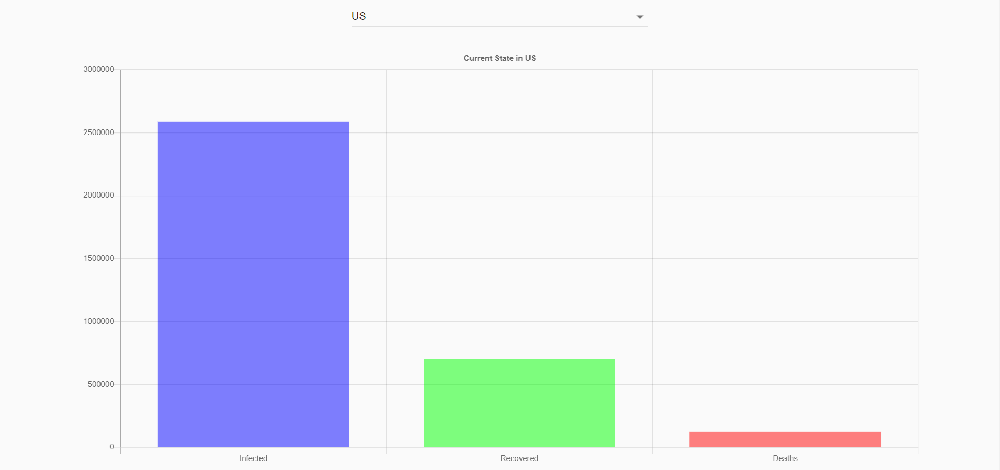

# Corona Tracker

Welcome to the COVID-19 Tracker web application! Here you can see realtime updates on important statistics such as confirmed case number, deaths, and recoveries. The data is displayed both numericaly and visually with charts. You are able to see both data on a global scale, and also from an individual country's perspective. 

## Demo Images

### Global View

### Country View

## Acknowledgements 
Thanks to [JS Mastery](https://www.youtube.com/channel/UCmXmlB4-HJytD7wek0Uo97A) for the project walkthrough and tutorial. I built this site alongside this channel's video to familiarize myself with React Hooks, JavaScript and Web Development.

